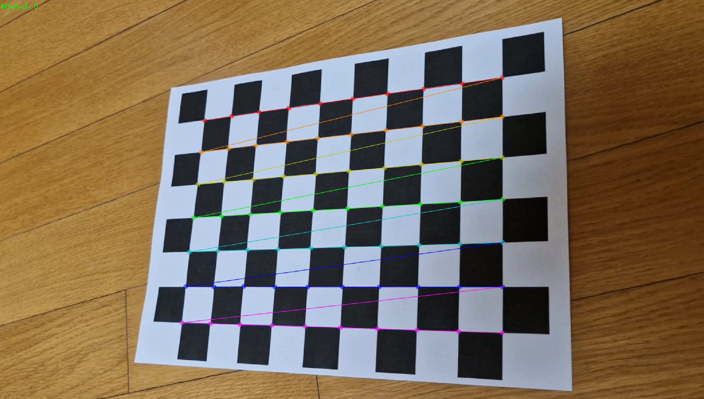
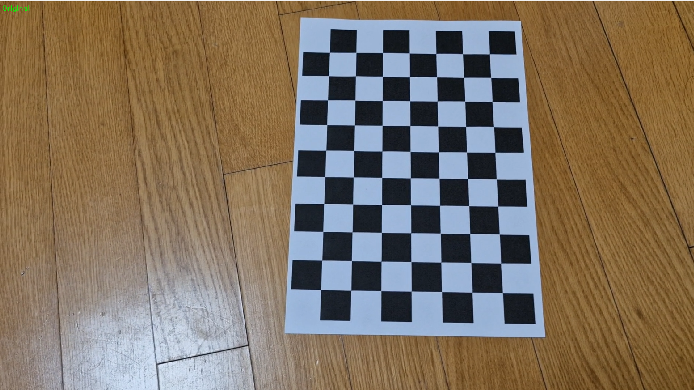
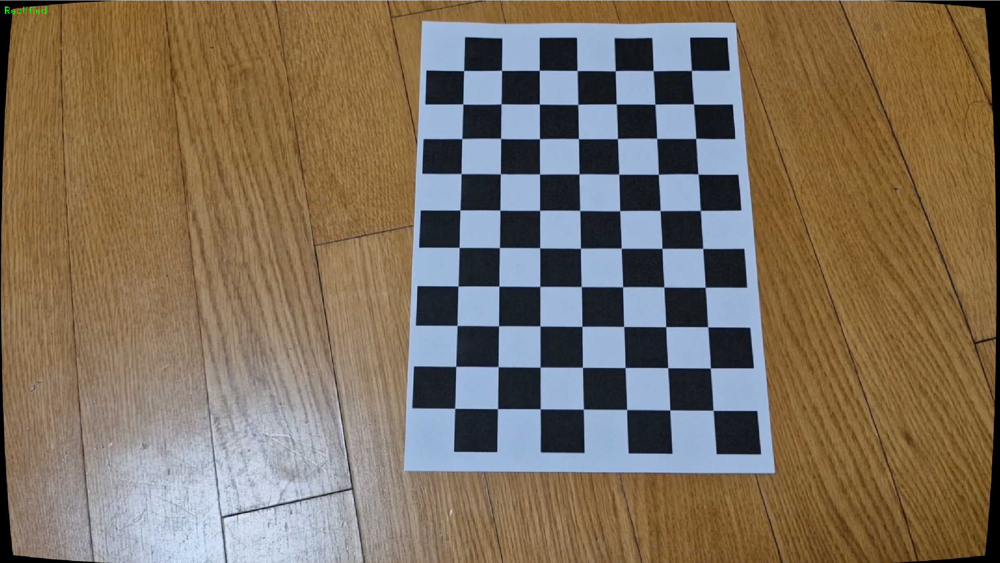

# CalibNCorrectChess
Camera calibration and distortion correction using a video of a chessboard pattern

# 주요 기능

휴대폰 카메라로 chessboard image를 촬영한 video의 camera calibration을 진행
galaxy S23 FE 기본 카메라 사용, sample video는 용량 축소를 위해 audio를 제거하고 해상도를 480p로 낮춤

- space : chessboard의 코너 찾기
- enter : 이미지 선택
- esc : 종료
- 
선택한 이미지를 기반으로 값을 얻어 결과를 .npz파일로 저장

저장된 결과를 불러와서 distortion correction을 진행

- space : 일시정지
- tab : 모드 변경 Original/Rectified
- esc : 종료

# 결과

Calibration Chessboard

변수 목록: ['rms', 'K', 'dist', 'rvecs', 'tvecs']

rms = 0.6233493087745796

Camera Matrix(K) =
[[1.69350596e+03 0.00000000e+00 9.63466406e+02]
 [0.00000000e+00 1.69480956e+03 5.41054227e+02]
 [0.00000000e+00 0.00000000e+00 1.00000000e+00]]

fx = 1693.51 fy = 1694.81 cx = 963.47 cy = 541.05

Distortion Coefficients =
[[ 2.79195046e-03 -4.05592721e-01  1.80960831e-04  2.66002687e-04
   1.53740798e+00]]

총 15 장면을 선택해서 진행
rvecs, tvecs는 보정에 사용되지 않음

Distortion Correction

휴대폰 기본 카메라도 충분히 좋은 성능을 가지고 있어 original 영상도 눈에 띌 정도로 심한 왜곡은 보이지 않는다
